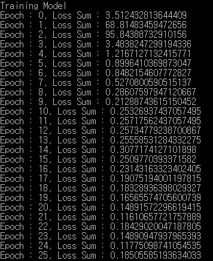
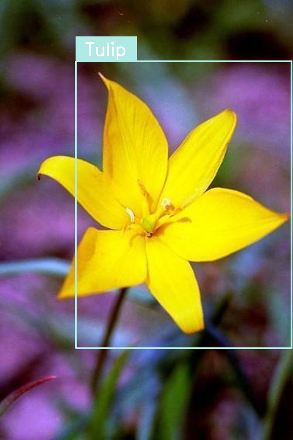

Object Detection using Tensorflow Faster R-CNN
===========================================

Tensorflow implementation of Faster R-CNN.
http://www.rossgirshick.info/  
Using 17 Category Flower Dataset.
http://www.robots.ox.ac.uk/~vgg/data/flowers/17/
	
	Faster R-CNN: Towards Real-Time Object Detection with Region Proposal Networks
  Shaoqing Ren, Kaiming He, Ross Girshick, Jian Sun
  Neural Information Processing Systems (NIPS), 2015

Training Usage
-----

    python TrainingModel.py cnn_model_file cnn_mean_file train_data_file
      output_rpn_model_file output_detection_model_file
    
    ex)
    python TrainingModel.py ./alexnetconv/alexnet_model.npy ./alexnetconv/alexnet_mean.txt ./data/train_data.txt
      ./rpn/rpn_model.npy ./detection/detection_model.npy

Training Result
-----

Detection Usage
-----

    python DetectionImage.py cnn_model_file cnn_mean_file rpn_model_file
      detection_model_file label_file input_image_file output_image_file
    
    ex)
    python DetectionImage.py ./alexnetconv/alexnet_model.npy ./alexnetconv/alexnet_mean.txt ./rpn/rpn_model.npy 
      ./detection/detection_model.npy ./alexnetconv/flower_classes.txt ./example/tulip.jpg ./example/tulip_result.jpg

Detection Result
-----

 
